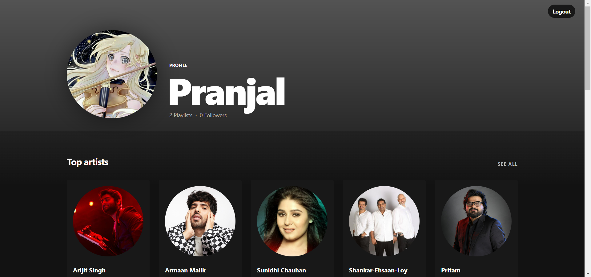
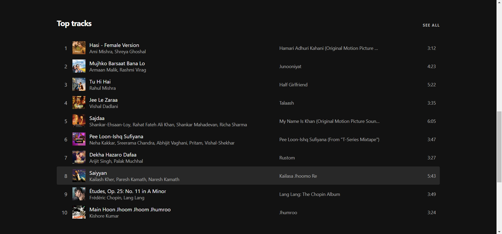
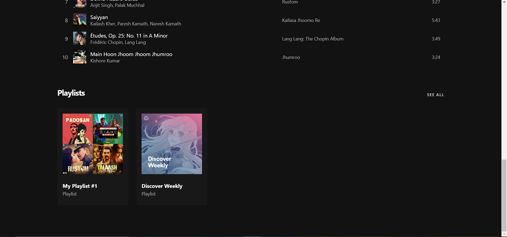
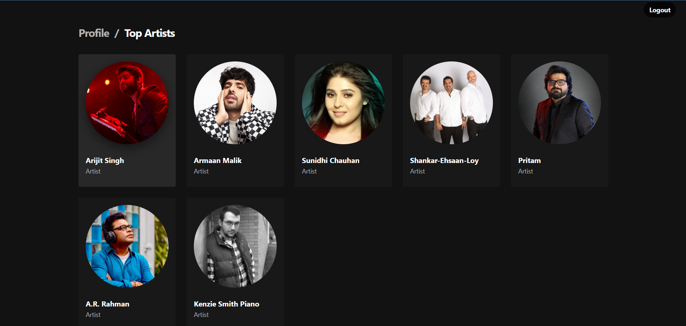
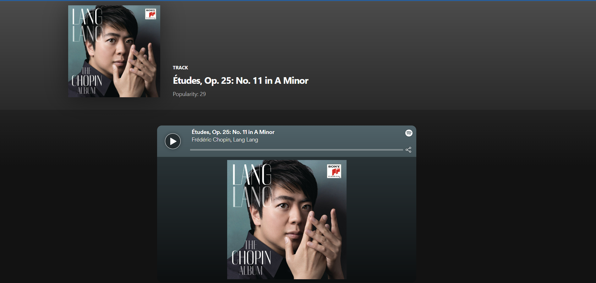
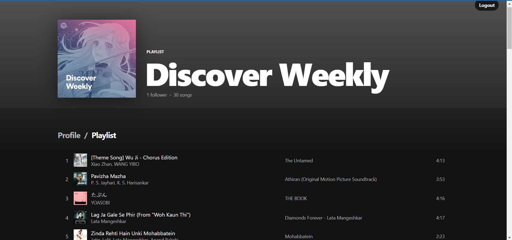

# Spotify Stats Site

> A site to see your recent top tracks, playlists and artists

This Site made with __Nodejs__ and __react__ helps its users to see their __Spotify__ profile with their recently played tracks, public playlists and recent artists using the [spotify api](https://developer.spotify.com/documentation/web-api/). 

This is a beginnner's project to learn basic react routing, adding components, using hooks, API calls using axios and other stuff.

---
## Profile Page

Part One: User Profile and Top Tracks

Part Two: User's Top Tracks

Part Three: User's Playlists

---

## Top Artists Page

---
## Top Tracks Page

---

## Search functionality and individual tracks pages

* Note that user can also play the song on this page using the iframe presented
---

## Individual PlayList Page

---
## Installing instructions
1. Clone this repository 
2. Go to spotify developer to get client id and client secret
3. Make a .env file with Client id and client secret and add this line:
> Redirect_URI=http://localhost:8888/callback
4. Add this redirect URI in your spotify app too.
5. Open terminal in server folder and run the following command:
> npm install
6. Run the following command:
> npm start
7. Open the browser and go to http://localhost:3000/
8. Login with spotify and you should see your profile and top tracks.

---
## Future additions to be made

1. Adding a recommender system which will prompt user some filter and after that will use spotify api based on those filters to get recommendations
2. Adding functionality to add recommended playlists and tracks to favourites.

